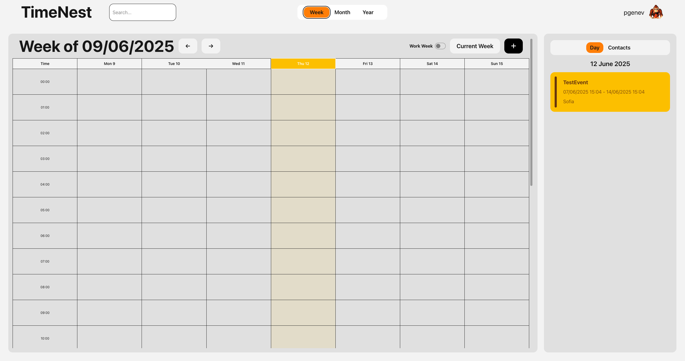

# 🕒 TimeNest – Team Calendar App

**TimeNest** is a full-featured collaborative calendar application built for teams. It supports multi-day and recurring events, shared contact lists, and admin-level user management. Designed with productivity and usability in mind, it works seamlessly across both light and dark themes.

---

## 🚀 Features

- 🔐 **Authentication**
  - Register/login with Firebase Auth
  - Protected routes using React Router

- 📅 **Calendar Views**
  - Month, Week, Work Week and Year views
  - Interactive time grid with dynamic event rendering
  - Sidebar for day events and contact management

- 📝 **Event Management**
  - Create, view, edit, and delete events
  - Supports multi-day and recurring (weekly/monthly) events
  - Event access control (public/private, participants)

- 👥 **User & Contact Lists**
  - Add/remove users to custom contact lists
  - View other user profiles and shared events

- 🧑‍💼 **Admin Features**
  - User list management
  - Admins can edit or delete any event

- 🌗 **Themes**
  - Toggle between "bumblebee" (light) and "halloween" (dark) themes (DaisyUI)

---

## 🛠️ Tech Stack

- **React** + **TypeScript**
- **Firebase** (Auth + Realtime Database)
- **Vite** for bundling
- **Tailwind CSS** + **DaisyUI** for styling
- **Framer Motion** for animations

---

## 📁 Folder Structure (src/)

```
components/              → Reusable UI and feature components
providers/               → Context Providers: User, Alert, Dropdown
services/                → Firebase logic: authentication, events, users
pages/                   → Application views: HomePage, CalendarPage
utils/                   → Utility functions: calendar calculations, delays
constants/               → App-wide constants: icons, alert types, calendar view types
```

---

## 🧪 Setup Instructions

### 1. Clone the repo

```bash
git clone https://github.com/Team-01-GA/Team-01-GA-TimeNest.git
cd Team-01-GA-TimeNest
```

### 2. Install dependencies

```bash
npm install
```

### 3. Setup Firebase environment

Create a `.env` file:

```env
VITE_API_KEY=your_firebase_api_key
```

> The app uses Firebase Auth and Realtime Database. Ensure your Firebase project allows read/write and email/password sign-in.

### 4. Run locally

```bash
npm run dev
```

---

## 🧩 Architecture Notes

- **Routing & Modals**: All modals (auth, event, profile) are routed using `React Router` and wrapped in `AnimatePresence` for transitions.
- **Event Recurrence**: WeekView dynamically renders recurring weekly and monthly events based on logic in `getUserEventsForDate()`.
- **Multi-day support**: Events that span days are adjusted on display depending on the view (WeekView/MonthView).
- **Context providers**: Global state for auth, alerts, and dropdown positioning is managed using React Contexts.

---

## 📸 Screenshots

> A glimpse into TimeNest in action:

### 🗓️ Week View  


---

### 🗓️ Month View


---

### 🗓️ Year View  


---

### ✨ Create Event  


---

## 👨‍💻 Who Built It

This project was developed by:

- [Genko Valkinov](https://github.com/ValkinovG), [Alexander Atanasov](https://github.com/al-atanasov1)  Team 01 GA @ Telerik Academy

---